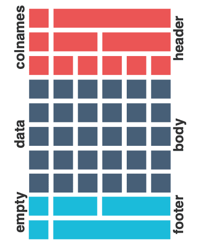
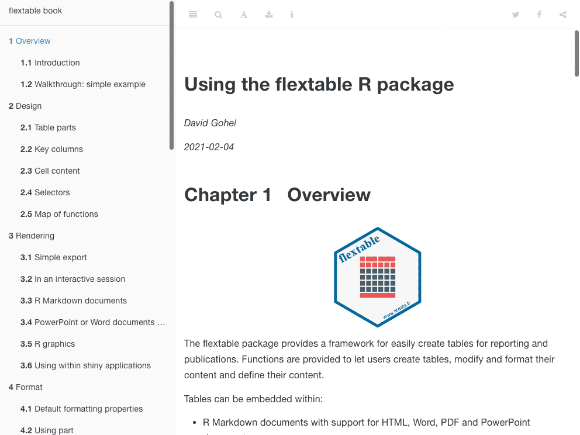
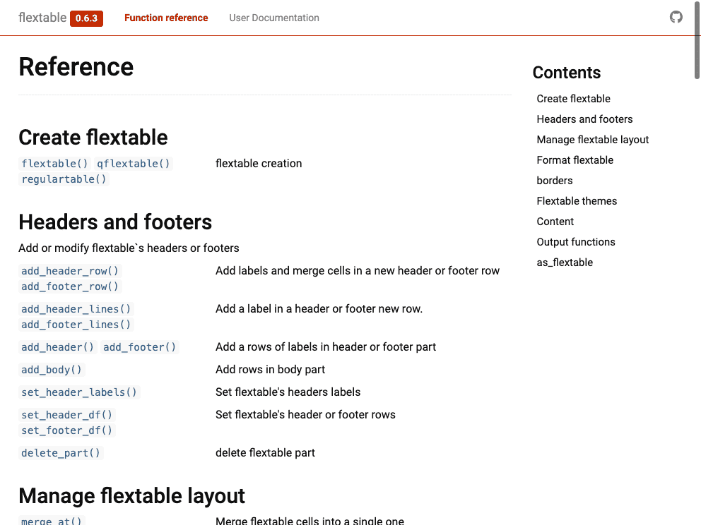
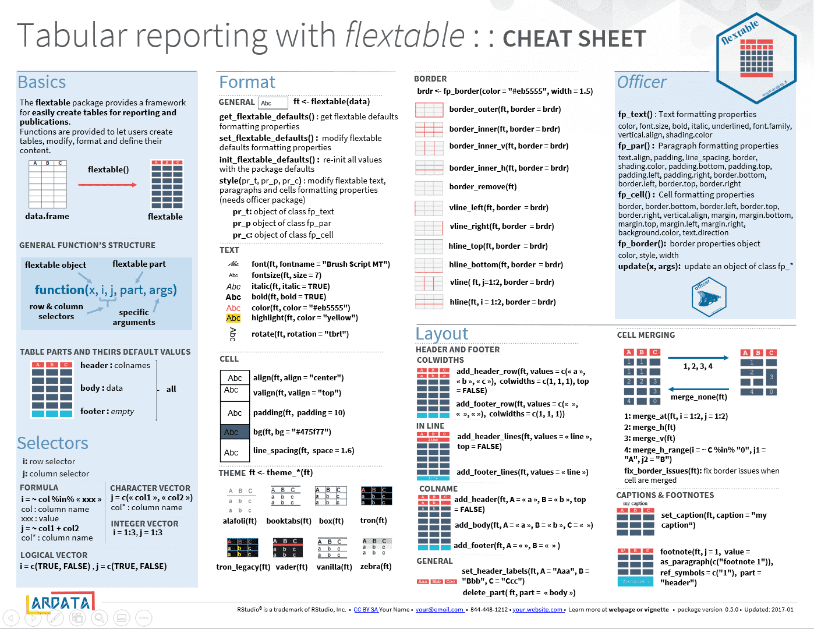
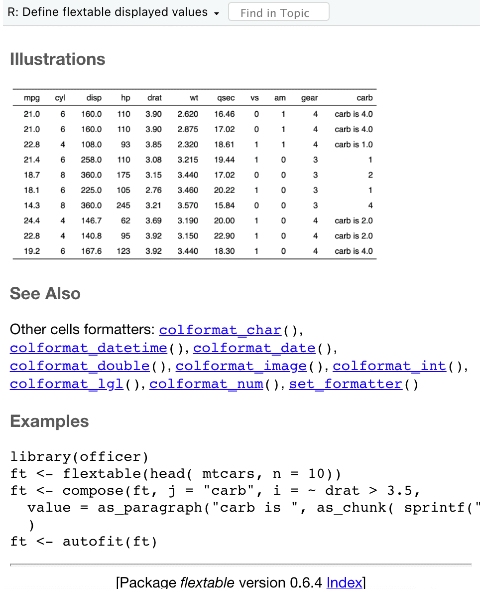

```{r setup, include=FALSE, message = FALSE, warning = FALSE}
library(dplyr)
library(ggplot2)
library(flextable)
library(officer)
library(knitr)
library(data.table)

source("R/utilities.R")
knitr_opt_set("talk")

hook_source <- knitr::knit_hooks$get('source')
knitr::knit_hooks$set(source = function(x, options) {
  x <- stringr::str_replace(x, "^[[:blank:]]?([^*].+?)[[:blank:]]*#<<[[:blank:]]*$", "*\\1")
  hook_source(x, options)
})

```

# About me

.pull-left[

.center[

Me and my family

`r fontawesome::fa("male", height="3.4em", fill = "#C32900")` `r fontawesome::fa("female", height="3.4em")` `r fontawesome::fa("child", height="2.4em")` `r fontawesome::fa("baby", height="1.6em")`

Some of my open source

[](https://CRAN.R-project.org/package=ggiraph) [](https://CRAN.R-project.org/package=officer) [](https://CRAN.R-project.org/package=flextable) [](https://CRAN.R-project.org/package=officedown) [](https://CRAN.R-project.org/package=fpeek)


Funder of 


Based in Paris, France

]


]


.pull-right[

[at https://www.ardata.fr](https://www.ardata.fr)

`r fontawesome::fa("users-cog", height="1.7em")` With Clémentine and Panagiotis

`r fontawesome::fa("r-project", height="1.7em")` package development, deploiement, support, migration, shiny development

`r fontawesome::fa("server", height="1.7em")` scientific cloud computing environment (jupyterhub, RStudio, ...)


`r fontawesome::fa("chalkboard-teacher", height="1.7em")` R Trainings


]

---
class: middle, center

# Short introduction to 


---
## Why flextable?


* Tables, just like graphs, can be a very good way to provide 
synthetic and clear information. 

* They are easy to read by our public.

* They must be easy to produce from R.

* My customers always ask for nice tables, in Word, PowerPoint 
or HTML (not so much for PDF). 

---
## Package overview

.card.noborder[

.card.width-50[
.section[**1 - Extensive formatting capabilities**]
.section.font-sm[

The package offers a flexible and rich syntax allowing:

* merging cells, 
* add header lines, 
* change formats,
* modify the display of the data in the table .

.hline[]

.font-sm[
plus mix text, images, ggplot, hyperlinks
]
]
]


.card.width-46[
.section[**2 - Publication-Quality**]
.section.font-sm[

.font-sm[

`r fontawesome::fa("tag", height="1.1em", fill = "#C32900")` Support for caption and cross-references in HTML, Word and PDF

`r fontawesome::fa("code", height="1.1em", fill = "#C32900")` Everything can be coded, no "copy paste your table"

`r fontawesome::fa("industry", height="1.1em", fill = "#C32900")` Already used by CRO, 
pharmaceutical companies, public health institutes, ...

]
]
]


.card.width-36[
.section[**3 - Static tables**]
.section.font-sm[

A flextable is a static table that shows the data contained in a **data.frame**,

.hline[]

.font-sm[


or that shows a view of data transformed by **as_flextable**. 

]

]

]


.card.width-30[
.section[**4 - Supported outputs**]
.section.font-sm[


.hline[]

.font-sm[
&#43; support for png output via webshot
]
]
]


.card.width-28[
.section[**5 - Documentation**]
.section.font-sm[

A detailed&nbsp;<a href="https://ardata-fr.github.io/flextable-book/">documentation</a> with many illustrations is available, made with 


]
]


]


---
## History

.bigul[

* **2017-03-28**: first realease on CRAN, support officer and HTML R Markdown.
  Idea was to replace `ReporteRs::FlexTable`.
* **2017-10-30**: Merge pull request #37 from mnazarov/master.
  Added functionality to insert flextable's in R Markdown for docx output.
* **2017-11-22**: R Markdown support for pptx output.
* **2019-01-29**: Refactor internals and add `flextable::compose` (for complex formatting)

]


---
## A first example

```{r}
flextable(airquality[ sample.int(5),]) %>% 
  add_header_row(colwidths = c(4, 2), values = c("Air quality", "Time")) %>% 
  theme_vanilla() %>% 
  add_footer_lines("Daily measurements in New York, May to September 1973.") %>% 
  color(part = "footer", color = "#666666") %>% 
  set_caption(caption = "New York Air Quality Measurements")
```

---
class: center, middle
# Principles

---
## Parts of a flextable

A flextable is composed of 3 parts:

.pull-left[



]

.pull-right[


**header**: by default, there is only one line containing 
the names of the data.frame columns.

**body**: contains the data from the data.frame.

**footer**: by default, this part is not available, but it 
may contain footnotes and any other content.

.oc-bg-gray-0[part=all] <==> .oc-bg-pink-3[header + body + footer]


]


---
## Columns to display

.pull-left[

* The `col_keys` argument of the `flextable` function allows to select the columns
of the data.frame to be displayed.
* The other columns can however be used later.
* If a column is filled in the argument but does not exist, an empty column will
be created.

]

.pull-right[

```{r}
dat <- head(airquality, n = 3)
flextable(dat)
```

]


.pull-left[

```{r}
flextable(data = dat, 
 col_keys = c("Ozone", "Temp", 
              "Month", "Day"))
```

]

.pull-right[

```{r}
flextable(data = dat, 
 col_keys = c("Month", "Day", 
              "dummy", "Ozone"))
```

]


---
## Selectors

.pull-left[


**Selectors** let you select rows and or columns where operations will be applied.

They are available to format (change color, background color, borders), define 
the content of the cells, merge cells, ...

The `i` selector corresponds to the rows and the `j` selector corresponds to the columns. They can be expressed in different ways:

* as a formula: `i = ~ col %in% "xxx"`, `j = ~ col1 + col2`.
* as a character vector: `j = c("x", "y")`.
* as an integer vector: `i = 1:3`, `j = 1:3`.
* as a logical vector: `i = c(TRUE, FALSE)`, `j = c(TRUE, FALSE)`.

]

.pull-right[

```{r}
ft <- flextable(dat)
ft %>% 
  color(
    i = ~ Ozone < 40, #<<
    j = c("Ozone", "Solar.R"), #<<
    color = "orange")
```


]


---
## Cell content

By default, the cells of the flextable are filled with 
the content of the data.frame cells.

.pull-left[

```{r}
ft <- flextable(dat)
ft
```

```{r}
ft <- colformat_double(ft, digits = 2) %>% 
  colformat_int(prefix = "#") 
ft
```

]

.pull-right[


You can change the displayed content of a cell with the following functions :

* `colformat_double`, to define how to display `double` columns,
* `colformat_int`, to define how to display `int` columns,
* `colformat_char`, to define how to display `character` columns,
* `colformat_datetime()` & `colformat_date()`, 
* `colformat_image()`, 
* `colformat_lgl()`, 
* `colformat_num()`


]


---
## Cell with multi-content

The cells of the flextable are filled with more than a *content*.

.pull-left[

```{r}
ft <- flextable(dat, 
  col_keys = c("Month", "Day", "Solar.R"))
ft <- compose(ft, 
  j = "Solar.R",
  value = as_paragraph( #<<
    Solar.R, " (", as_b(Ozone), ")"  #<<
  ) #<<
)
ft
```

]

.pull-right[

```{r}
ft <- compose(ft, 
  j = "Solar.R", i = 1, part = "header",
  value = as_paragraph(#<<
    as_i("Solar"), " ",  #<<
    colorize(as_sup("R"), "red"))  #<<
)
ft
```

]

---
## As flextable

Function `as_flextable` is a generic function to cast objects into flextable.

So far, this method exist for objects `lm`, `glm`, `mgcv::gam`, `xtable`, `htest`, `as_grouped_data`.


```{r message=FALSE}
dat <- attitude
dat$high.rating <- (dat$rating > 70)
probit.model <- glm(high.rating ~ learning + critical +
   advance, data=dat, family = binomial(link = "probit"))
ft <- as_flextable(probit.model) #<<
ft
```


---
class: center, bg_hf

# Header and footers

```{css, echo = FALSE}
.bg_hf {
  position: relative;
  z-index: 1;
}

.bg_hf::before {    
  content: "";
  background-image: url('static/assets/img/flextable_layout_header_footer.png');
  background-size: 50%;
  position: absolute;
  top: 30%;
  bottom: 0;
  left: 50%;
  z-index: -1;
  right: 0;
  background-repeat: no-repeat;
}
```

---
## Header labels

This is the bottom row of the header part (or the only row by default).

```{r}
ft <- flextable(head(airquality), 
  col_keys = c("Month", "Day", "Solar.R")) %>% 
  set_header_labels(Solar.R = "Solar R (lang)")
ft
```

---
## Set default values to ease your work


The default formatting properties (see `get_flextable_defaults()`) are automatically applied to every flextable you produce. Use `set_flextable_defaults()` to override them. Use `init_flextable_defaults()` to re-init all values with the package defaults.


.pull-left[

```{r}
set_flextable_defaults(font.size = 10, 
  padding = 5, 
  font.family = "Arial", 
  na_str = "", 
  # eastasia.family =   #<<
  post_process_html = function(x){
    x <- theme_booktabs(x)
    autofit(x, part = "body")
  })

ft <- flextable(head(airquality), 
  col_keys = c("Month", "Day", "Solar.R")) %>% 
  set_header_labels(
    Solar.R = "Solar R (lang)")
```

]

.pull-right[

```{r echo=FALSE}
ft
```


]


---
## Add more rows

.pull-left[

To add lines to a flextable, the `add_header_row` and `add_footer_row` functions are available. The `colwidths` argument will indicate the number of columns for each new cell being added.

```{r}
ft <- flextable(head(airquality)) 
```

]

.pull-right[


```{r}
ft <- add_header_row(
  x = ft, 
  values = c("measurements", "time"),  #<<
  colwidths = c(4, 2))  #<<
```

]

```{r echo=FALSE}
ft
```


---
## Sugar function: add lines

.pull-left[

The functions `add_header_lines` and `add_footer_lines` allow you to add rows to the table at the header or at the end of the table, these rows will contain only one single cell.

]

.pull-right[

```{r}
ft <- add_header_lines(ft,
  values = c(
    "this is a first line",
    "this is a second line"
  )
)
```


]

```{r echo=FALSE}
ft
init_flextable_defaults()
```


---
class: center, inverse
background-image: url("static/assets/img/mario-kart-8-deluxe-review.jpg")


# Walkthrough with Mario Kart characters

---
## Hidden statistics of Mario Kart characters?

In Mario Kart 8 Deluxe on Switch, each character has its own set of statistics, but unlike karts and customization elements, they are not displayed directly on the screen.

Characters all have their own very precise statistics: speed (different 
according to the environment), maneuverability, power of mini-turbos, absolute speed, ...

These parameters are rated out of 6 and have been listed by the community 
of fans of the game.

We will use flextable to present the detail of these statistics by characters.

Data are available here: https://docs.google.com/spreadsheets/d/1g7A-38tn9UAIbB2B3sZI-MpILsS3ZS870UTVMRRxh4Q/edit#gid=0


---
## Expected result

```{r echo=FALSE}
source("codes/mario.R")
ft
```

---
## The flextable code

Open [`codes/mario.R`](https://github.com/ardata-fr/flextable-whyr/blob/main/codes/mario.R)


---
class: center
background-image: url("static/assets/img/fig_formats.png")

# Adding to a document


---
## With officer technology

Inserting a flextable in a document can be done in different ways:

* For Word, use `flextable::body_add_flextable()` function.

* For PowerPoint, use `officer::ph_with()` function.

```{r include=FALSE}
source("codes/mario.R")
```


```{r eval=!file.exists("reports/mario-officer.docx")}
read_docx() %>% 
  body_add_flextable(ft) %>%  #<<
  print(target = "reports/mario-officer.docx")

read_pptx() %>% 
  add_slide() %>% 
  ph_with(ft, location = ph_location_type()) %>%  #<<
  print(target = "reports/mario-officer.pptx")
```


---
## Easy exportation


.pull-left[

Commands: 

* `save_as_docx()`, 
* `save_as_pptx()`, 
* `save_as_html()`,
* `save_as_image()`

For interactive mode, use one of these commands: 

* `print(x, preview = "docx")`, 
* `print(x, preview = "docx")`, 
* `print(x, preview = "docx")`, 
* `plot(x)`


]

.pull-right[


```{r eval=!file.exists("reports/mario.docx")}
save_as_docx(ft, path = "reports/mario.docx",
 pr_section = prop_section(
  page_size = page_size(
    width = 15, height = 11, 
    orient = "landscape"),
  type = "continuous"))

save_as_pptx(ft, path = "reports/mario.pptx")


# print(ft, preview = "pptx")
```

```{r}
plot(ft)
```


]

---
## With "R Markdown" technology


Usual way:

```{r eval=FALSE}
ft <- qflextable( head( airquality ))
ft #<<
```

Loops

> [...] `for`, `while`, and `repeat` loops always return an invisible NULL, 
so nothing will be printed automatically [...]  
https://yihui.org/en/2017/06/top-level-r-expressions/

Use chunk option `results='asis'` and function `flextable_to_rmd`:

```{r eval=FALSE}
for(i in seq_along(ft_list)){
  flextable_to_rmd(ft_list[[i]]) #<<
}
```

---
class: center, inverse

# Latest advances / unknown features

---
## Documentation

User guide: https://ardata-fr.github.io/flextable-book/

.row[

.col-xs-3[

&nbsp;
]

.col-xs-5[

```{r include=FALSE, eval=!file.exists("static/assets/img/flextable-book.png")}
webshot2::webshot("https://ardata-fr.github.io/flextable-book/", 
                  file = "static/assets/img/flextable-book.png")
```





]

]


.pull-left[

Function reference: https://davidgohel.github.io/flextable/reference/index.html

```{r include=FALSE, eval=!file.exists("static/assets/img/flextable-pkgdown.png")}
webshot2::webshot("https://davidgohel.github.io/flextable/reference/index.html", 
                  file = "static/assets/img/flextable-pkgdown.png")
```



]

.pull-right[

Cheat sheet (not yet available), thanks to Clémentine Jager.



]


---
## Cross-references and captions


Captions are supported for HTML, PDF and Word output (also from a bookdown project with its specificities taken into account).

The recommended method to set a caption is with function `set_caption`.

```{r eval=FALSE}
ft <- set_caption(ft, "a correlation matrix", 
  autonum = run_autonum(seq_id = "tab", 
                        bkm = "corr-table"))
```

But the knitr chunk options can be use instead:

* `tab.cap`: Caption label
* `tab.id` or `label`: Caption reference unique identifier, the latest is 
for compliance with bookdown syntax.

https://ardata-fr.github.io/flextable-book/captions-and-cross-references.html


---
## PDF output

flextable supported outputs were HTML, Word and PowerPoint. This has just been extended to PDF.

* Overall is good
* Need some work with widths and heights management
* No issues about that, it's not yet used by users


---
## Less verbose is cool

* `set_flextable_defaults()` should let you to not use `font`, `fontsize`, 
`padding`, `colformat_double`, etc.

* `compose` gained argument `use_dot`: when using `as_paragraph`, value 
is evaluated within a `data.frame` augmented of a column named `.` 
containing the `j`th column.

.pull-left[

```{r}
gg_bars <- function(z) {
  z <- na.omit(scale(z))
  z <- data.frame(x = seq_along(z), z = z, w = z < 0)
  ggplot(z, aes(x = x, y = z, fill = w)) +
    geom_col(show.legend = FALSE) + theme_void()
}
dat <- as.data.table(mtcars)
z <- dat[,
  lapply(.SD, function(x) list(gg_bars(x))),
  by = c("vs", "am"), 
  .SDcols = c("mpg", "disp")
]
ft <- flextable(z)
```

]

.pull-right[

```{r}
compose(ft, 
  j = c("mpg", "disp"),
  value = as_paragraph(
    gg_chunk(value = ., #<<
             height = .15, width = 1)
  ),
  use_dot = TRUE#<<
)
```

]


---
## Use flextable as default *table* output

See https://cran.r-project.org/web/packages/knitr/vignettes/knit_print.html

```{r eval=FALSE}
table_print = function(x, ...) {
  flextable(x) %>% theme_vanilla()
}
# register the method
registerS3method("knit_print", "data.frame", table_print)
registerS3method("knit_print", "grouped_df", table_print)
registerS3method("knit_print", "spec_tbl_df", table_print)
registerS3method("knit_print", "tbl", table_print)
```


---
## Miscellaneous

.pull-left[

* HTML rendered within shadow-dom, tables rendering was mixing flextable formattings 
and the web page formattings. Shadow-dom helps to keep the rendering 
isolated from the rest of the document.

* Better support for non-latin alphabet in Word

```{r eval=FALSE}
set_flextable_defaults(
  font.family="Arial", 
  cs.family = "Symbol", 
  eastasia.family = "仿宋")

df = data.frame(
  `标题Title`='微软MS',
  `内容Content`='无题lorem',
  stringsAsFactors = FALSE)
print(flextable(df), preview = "docx")
```

]

.pull-right[

* Manuals are containing illustrations



]


---
## Tabular packages with flextable output

* ftExtra: https://cran.r-project.org/package=ftExtra

* flexpivot: https://dreamrs.github.io/flexpivot/

* gtsummary: http://www.danieldsjoberg.com/gtsummary/

* crosstable: https://CRAN.R-project.org/package=crosstable

* compareGroups: https://CRAN.R-project.org/package=compareGroups

* ...

---
class: center, inverse
background-image: url("static/assets/img/le-cri.jpg")
background-size: cover

# Maintenance and support


---
## Maintenance and support


.rect.round-md.lime[

.oc-red-9[

flextable is actively maintained

]

]

Using the package, questions and help: https://stackoverflow.com/questions/tagged/flextable

Found a bug, feature request: https://github.com/davidgohel/flextable/issues


.rect.round-md.lime[

.oc-red-9[

How is the maintenance organized?

]

]


- Questions from users: documentation will be completed

- Bugs: fix them - usually fixed within a month

- Evolutions: if possible, no time commitment


---

.pull-left[

## Possible new features

* RTF output, for pharmaceutical companies
* `append` and `prepend` in cells

]

.pull-right[

## Path to version 1.0.0 

* Add visual testing
  * https://github.com/ardata-fr/doconv
* Complete the manual; add a gallery of examples; link to manuals (as with pkgdown)
* minimize size when using images

]

---
class: center, middle, inverse

```{css echo=FALSE}
.manual{
  font-family: 'Permanent Marker';
  font-size: 5em;
  color: white;
}

```

.manual[

Thank you

]

Link to GitHub repository: https://github.com/ardata-fr/flextable-whyr

Link to the presentation: https://youtu.be/-EuPFZCTnHE and https://ardata-fr.github.io/flextable-whyr


